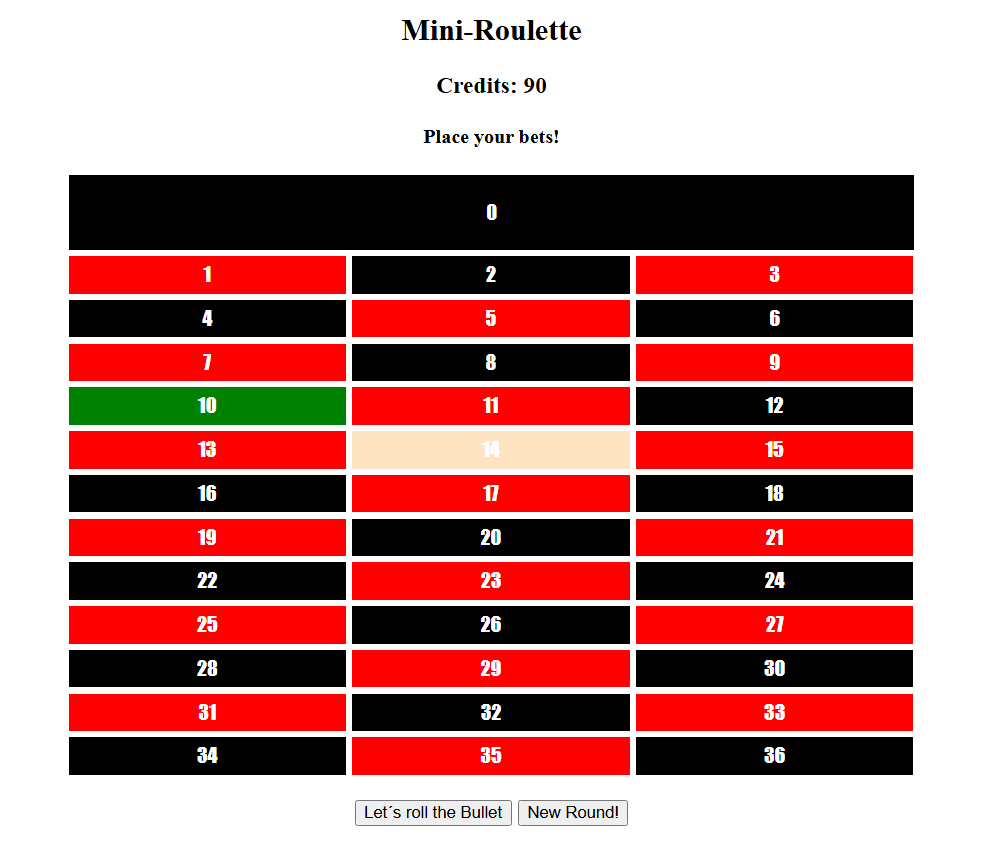

## 1. Praktische Leistungsfeststellung (Haupttermin, 26.11.2024)

**Name:**

### 1) Name und Projekt

Kopiere die Angabe der PLF (bestehender Code) in den Ordner \newline
 ```D:\Schularbeiten\Testabgabe\Simon_Planberger``` \newline
**Arbeite nicht im Temp-Verzeichnis!**

### 2) Typsystem, Operatoren (5)

```JS
typeof [0, 1, 2]
```

* [x] object
* [ ] array

```JS
typeof (3 < 4)
```

* [x] boolean
* [ ] number

``` JS
''
```

* [ ] truthy-value
* [x] falsy-value

``` JS
const a = [1, 2, 5];
a.push(10);
```

* [ ] Nicht Möglich.
* [x] Möglich.

```JS
const a = 23;
const b = 42;

console.log(a || b);
```

* [x] 23
* [ ] 42

### 3) Römische Zahlen (15)

Bevor die arabischen Zahlen (Dezimalzahlen) ab dem 10. Jahrhundert in Europa (ab dem 15. Jahrhundert in Deutschland) eingeführt wurden, hatte man die römischen Zahlen zum Rechnen und Schreiben verwendet.

Schreiben Sie eine Funktion `getRoemisch(number)` welche eine Dezimalzahl von größer 0 bis kleiner gleich 50 bekommt. Diese Funktion gibt die Dezimalzahl als Römische Zahl zurück.

#### Hinweis

Folgende Zahlzeichen besitzen folgende Werte:

* I = 1
* IV = 4
* V = 5
* IX = 9
* X = 10
* XL = 40
* L = 50

29 >= 10 = X;
19 >= 10 = X;
9 >= 9 = IX;

```JS
console.log(getRoemisch(29)); // XXIX
console.log(getRoemisch(44)); // XLIV
console.log(getRoemisch(50)); // L
```

### 4) Functions (10)

Implementieren Sie eine Funktion höherer Ordnung ```getAddX``` welche eine Funktion zurückgibt, welche immer eine bestimme Zahl z.b. 6 zu einer anderen Zahl hinzufügt.

```JS
const add6 = getAddX(6); // Creates a new function with x = 6

const sum = add6(10); // Calls the new function with n = 10, resulting in 16
console.log(sum); // 16
```

\newpage

### 5) Iterator-Functions | map

The **map-Funktion** in JavaScript ist eine Methode, die für Arrays verfügbar ist und ein neues Array erstellt, das mit den Ergebnissen gefüllt ist, die durch Aufrufen einer bereitgestellten Funktion für jedes Element des aufrufenden Arrays erzeugt werden. Sie ändert das ursprüngliche Array nicht.

#### 5.1 myMap (20)

Implementiere deine eigene myMap als Iterator-Function.  

```JS
const numbers = [1, 2, 3, 4];
const doubled = myMap(array, number => number * 2);

console.log(doubled); // Output: [2, 4, 6, 8]
```

#### 5.2 Transform (10)

Gegeben sind Arrays von JS-Objekten (siehe Angabe). Es handelt sich um Artikel ```articleId``` die einen bestimmten Lagerstand auf beliebige Läger ```yards``` haben (Hierarchische-Struktur).
Jedes Lager besitzt eine eindeutige ID ```yardId``` sowie verfügbare ```availableAmount``` und reservierte ```reservedAmount``` Lagermengen.

Es sollen, unter der Verwendung der ```myMap``` Funktion, alle Artikel mit deren aufsummierten Lagerständen ausgegeben werden.

```JS
{ articleId: 1, availableAmount: 80, reservedAmount: 15 }
{ articleId: 2, availableAmount: 100, reservedAmount: 23 }
{ articleId: 3, availableAmount: 120, reservedAmount: 30 }
{ articleId: 4, availableAmount: 140, reservedAmount: 37 }
{ articleId: 5, availableAmount: 160, reservedAmount: 45 }
{ articleId: 6, availableAmount: 180, reservedAmount: 53 }
{ articleId: 7, availableAmount: 200, reservedAmount: 60 }
{ articleId: 8, availableAmount: 220, reservedAmount: 67 }
{ articleId: 9, availableAmount: 240, reservedAmount: 75 }
{ articleId: 10, availableAmount: 260, reservedAmount: 83 }
```

Alle ```articleId``` als Objekte der Artikel von oben, mit einer gesamten ```reservedAmount``` kleiner 30 (Unter der Verwendung der filter-Funktion).

```JS
{ articleId: 1 }
{ articleId: 2 }
```

\newpage

### 6) DOM Manipulation | DOM Events

Folgende Regeln sind für das **Mini-Roulette** zu beachten.

Es gibt 37 Zahlen, von 0 bis 36, auf die man wetten kann. Im Mini-Roulette ist es nur möglich auf einzelne Zahlen zu wetten.

#### 6.1 Board anzeigen (10)

Es gibt eine Funktion ```function createBoard()```. Hier wird der Mini-Roulette Tisch erzeugt.
Der Tisch bildet eine Tabelle mit drei Reihen und jeweils zwölf Zeilen. Jede Zahl wird durch die CSS-Klassen ```number``` in Kombination mit ```even``` oder ```odd``` abgebildet.
Für die Zahl 0 gilt folgende Sonderregel. Diese bildet die erste Zeile und nimmt den Platz von drei Spalten ein, dabei muss die CSS-Klasse ```number-zero``` statt ```number``` gesetzt werden.

#### 6.2 Auswahl treffen (10)

Dafür werden die beiden DOM-Events ```mouseover``` und ```mouseout``` benötigt. Wenn Spielende die Maus über eine gültige Zahl bewegen, sollte diese per CSS-Klasse ```hover``` gesetzt und wieder zurückgesetzt werden. Bitte achte darauf, dass notwendige CSS-Klassen nur einmalig gesetzt werden.

#### 6.3 Wette platzieren (10)

Dafür wird das DOM-Event ```click``` auf das ```board``` benötigt. Einer Zahl muss die CSS-Klasse ```bet``` gesetzt werden, wenn erstmalig darauf geklickt wird.
Bitte achte darauf, dass notwendige CSS-Klassen nur einmalig gesetzt werden.

Zusätzlich müssen die Aktionsbutton ```spine``` "Werfe die Kugel" und ```reset``` "Neue Runde starten" aktiviert werden.

#### 6.4 Kugel werfen (10)

Dafür wird das DOM-Event ```click```  auf den Button ```spinButton``` benötigt. Es wird eine Zufallszahl zwischen 0 bis 36 generiert.
Anschließend wird überprüft ob die Zufallszahl in den gesetzten Zahlen vorkommt ```betNumbers```.
Es soll folgender Text im Element ```infoHeadline``` erscheinen wenn die Zahl erraten wurde "4 - Winner" oder "4 - Casino takes it all".

Für die gedrehte Zufallszahl muss die CSS-Klasse ```winner``` auf das Element der Zahl gesetzt werden um den Spielenden die Zahl zu visualisieren.

#### 6.5 Ihre Einsätze bitte (10 | BONUS)

Die Spielenden starten mit 100 Credits ```START_MONEY```. Für jede platzierte Wette werden 10 Credits abgezogen, es dürfen solange Wetten platziert werden, solange noch Credits vorhanden sind.
Der aktuelle Credit-Stand soll per Funktion ```setMoney(HTMLElement element, money)``` aktualisiert werden.
Sind keine Credits mehr vorhanden, sollen die Spielenden auch nicht mehr in der Lage sein, Wetten zu platzieren.
Wenn der Spielende die Zahl erraten hat, soll er über die Konstante ```MULTIPLIER``` den x-Fachen Wetteinsatz als Credits zurückbekommen.
Wenn der Spielende keine Credits mehr besitzt und die Zufallszahl nicht getroffen wurde, haben die Spielenden verloren. Es soll der Text über die gegebene Funktion ```setMoneyIsOver(HTMLElement element)``` gesetzt werden.

##### Hinweise

```JS
// Returns a pseudorandom number between 0 and 1.
Math.random()

//Returns the greatest integer less than or equal to its numeric argument.
Math.floor(x: number): number
```



#### Punktetabelle

| Sehr gut       | Gut           | Befriedigend | Genügend      | Nicht genügend |
|----------------|---------------|--------------|---------------|----------------|
| 100...90       | 89...77       | 76...64      | 63...50       | 49...0         |